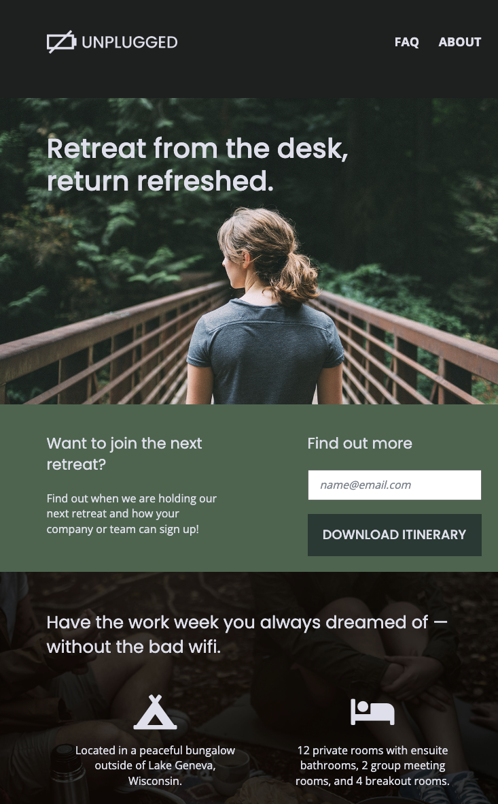

## Unplugged Retreat

### Description of the project

Unplugged is a fully responsive multipage website for a made up retreat center. The site is built with HTML and CSS and is based on a mobile-first approach. It includes flexbox, media queries and Google map integration.

### Challenges

- It took some getting used to working with the HTML5 Boilerplate
- In future, I might want to split out the CSS for the individual pages to make it easier to navigate

### Resources:

[HTML5 Boilerplate homepage](https://html5boilerplate.com/)
